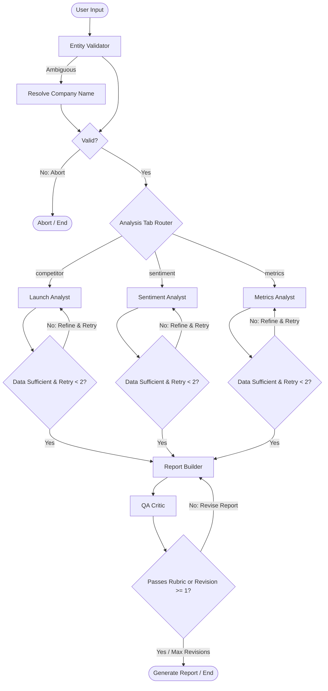

# 🚀 Product Launch Intelligence Agent

An **AI-powered multi-agent application** that delivers concise, evidence-backed product launch insights for **Product Managers, GTM teams, and Growth leaders**.

This application orchestrates multiple specialized agents using **LangGraph** to perform real-time research, validate scraped web intelligence, synthesize comprehensive market reports, and critique output quality.

---

## ✨ System Features

### 🤖 Coordinated Multi-Agent Team
*   **Entity Validator** – Performs initial safety and syntax checks on the inputs. Automatically resolves ambiguous queries or flags invalid inputs to abort early.
*   **Launch Analyst** – Evaluates competitor product positioning, strengths, weaknesses, and GTM strategies.
*   **Sentiment Analyst** – Extracts positive/negative customer themes and market perception.
*   **Metrics Analyst** – Evaluates KPI signals, adoption trends, traction, and financial performance.
*   **Report Builder** – Synthesizes raw observations into structured, publication-grade Markdown reports.
*   **QA Critic** – Evaluates the final report against a strict quality rubric. Feeds feedback back into the Report Builder if requirements are not met.

### 🛡️ Smart Data Fetching & Validation
*   **Structured Firecrawl Scrapes** – Performs targeted search queries, fetching relevant web articles programmatically.
*   **Streamlit Search Cache** – Caches queries locally for each company per day to prevent duplicate API hits and minimize rate limit issues.
*   **Double-Layer Validation** – Filters out block pages, crawler blocks, and irrelevant content programmatically, then performs LLM-based verification using `llama-3.3-70b-versatile` to enforce topical relevance and freshness (2024–2026).
*   **Self-Correction Retry Loop** – If search results are insufficient, the analyst generates refined queries using details of previous failures and automatically retries (up to 2 times).

---

## 🧱 Graph Workflow Architecture

The core of the application is a **LangGraph StateGraph** that manages state transitions and conditional routing:



### Workflow Node & Router Logic
1.  **Entity Validator Node**: Validates the input string to confirm it's a company or brand. If ambiguous (e.g., "Elon Musk's SpaceX"), it autocorrects and updates the state. If invalid, it transitions to `END`.
2.  **Tab Router**: Dynamically routes to the corresponding analyst node based on the selected Streamlit tab (`competitor`, `sentiment`, `metrics`).
3.  **Analyst Node Search & Validation**:
    *   Generates search queries using `llama-3.1-8b-instant`.
    *   Queries **Firecrawl** and caches results in the session state.
    *   Validates results using programmatic checks + a `llama-3.3-70b-versatile` evaluator.
    *   If fewer than 2 verified results are found, it increments the retry count, generates refined queries, and loops back to itself.
    *   Once sufficient results are retrieved (or retry limit is reached), it formats the sources and triggers the analyst LLM (`openai/gpt-oss-120b`) to extract insights.
4.  **Report Builder**: Synthesizes the analyst’s raw bullet points into an executive Markdown report.
5.  **QA Critic**: Inspects the generated report for empty table rows, contradiction, correct source attribution, and warnings for insufficient data. If the report fails QA, it triggers the report revision loop (max 1 revision).

---

## 📂 Project Structure

```
├── nodes/
│   ├── entity_validator.py     # LLM input guardrail and correction agent
│   ├── launch_analyst.py       # Competitor analyst agent
│   ├── sentiment_analyst.py    # Sentiment analyst agent
│   ├── metrics_analyst.py      # Metrics analyst agent
│   ├── report_builder.py       # Document synthesis agent
│   └── critic.py               # QA rubric critic agent
├── graph/
│   ├── state.py                # TypedDict AgentState definition
│   └── workflow.py             # StateGraph definition, compilation, and nodes
├── tools/
│   ├── query_generator.py      # LLM-based query generators (initial and refined)
│   ├── search.py               # Firecrawl search integration
│   └── validate.py             # Programmatic and LLM search result validation
├── main.py                     # Streamlit web interface and runner
├── requirements.txt            # Python dependencies
└── .env                        # Local API configuration secrets
```

---

## 🛠️ Tech Stack

*   **Frontend**: Streamlit
*   **Orchestration Framework**: LangGraph & LangChain Core
*   **LLM Provider**: Groq API
    *   *Analysts*: `openai/gpt-oss-120b` (for high-reasoning tasks)
    *   *Search Validation*: `llama-3.3-70b-versatile`
    *   *Critics & Helpers*: `llama-3.1-8b-instant`
*   **Search Infrastructure**: Firecrawl Search
*   **Config Management**: python-dotenv

---

## 📦 Installation & Setup

### 1️⃣ Clone the Repository
```bash
git clone https://github.com/your-username/product-launch-intelligence-agent.git
cd product-launch-intelligence-agent
```

### 2️⃣ Set Up a Virtual Environment
```bash
python -m venv venv
# On Windows:
venv\Scripts\activate
# On macOS/Linux:
source venv/bin/activate
```

### 3️⃣ Install Dependencies
```bash
pip install -r requirements.txt
```

### 4️⃣ Configure Secrets
Create a `.env` file in the root directory:
```env
GROQ_API_KEY=your_groq_api_key
FIRECRAWL_API_KEY=your_firecrawl_api_key
```
*Alternatively, you can provide these keys dynamically inside the application sidebar.*

---

## ▶️ Running the App

Run the Streamlit application from the project root:
```bash
streamlit run main.py
```
Open your web browser and navigate to:
```
http://localhost:8501
```

---

## 🧭 Application Usage Guide

1.  **Sidebar Configuration**: Insert your **Groq** and **Firecrawl** keys (if not set in `.env`).
2.  **Input Entity**: Enter a company name (e.g., `Tesla`, `OpenAI`).
3.  **Choose Tab**: Toggle between:
    *   🔍 **Competitor Analysis**
    *   💬 **Market Sentiment**
    *   📈 **Launch Metrics**
4.  **Analyze**: Click the analysis button. The app will visually render execution logs, showing real-time updates of queries, data verification reports, retries, and the final audited report.
